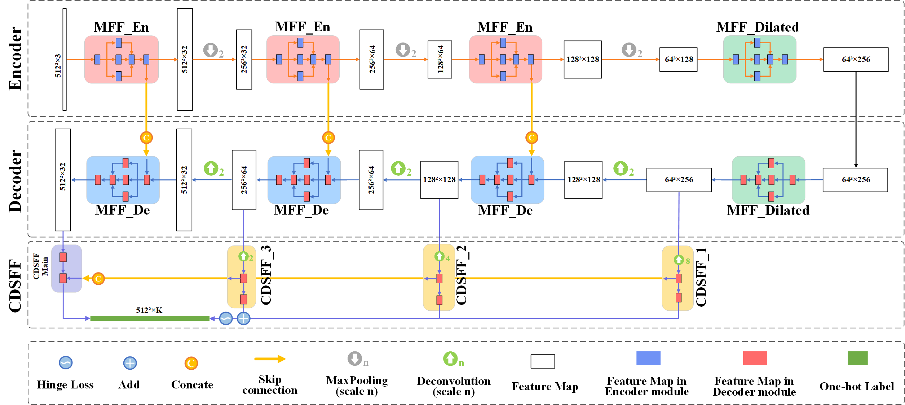

## [Controllably Deep Supervision and Multi-Scale Feature Fusion Network for Cloud and Snow Detection Based on Medium- and High-Resolution Imagery Dataset](<https://www.mdpi.com/2072-4292/13/23/4805>)


### CSD-Net

+ &ensp; &ensp; In our work,  a convolutional neural network named ***CSD-Net*** 🚀🚀🚀was proposed for cloud and snow detection in medium- and high-resolution satellite images of distinct sensors. 

  

### CSWV


+ &ensp; &ensp; Additionally , a novel high-resolution cloud and snow dataset (***CSWV***) was created and released. It contains two sub-datasets: the submeter-level high-resolution cloud and snow dataset (***CSWV_S6***) comprises six scenes with a resolution of 0.5 m; the meter- level high-resolution cloud and snow dataset (***CSWV_M21***) includes 21 resampled scenes with a resolution of 1–10 m. 


### Reference


+  &ensp;  &ensp; The full CSWV dataset can be downloaded at [Baidu Disk](<https://pan.baidu.com/s/1PviazxiYg_sNNHREdBYneg>) (password: `cswv`)  or [Google Drive](<https://drive.google.com/drive/folders/1vvKT0zN0nAHD_ECzHMCO1YzS8v2_ZHBM?usp=sharing>). Any questions, contact Mr. Guangbin Zhang 💌<font color=blue>&lt;202072509@Yangtzeu.edu.cn&gt;</font>. This dataset is shared for academic purpose only. If you use the dataset, you should appropriately cite our paper ([PDF](<https://www.mdpi.com/2072-4292/13/23/4805/pdf>)): 

+ ```Zhang, G.; Gao, X.; Yang, Y.; Wang, M.; Ran, S. Controllably Deep Supervision and Multi-Scale Feature Fusion Network for Cloud and Snow Detection Based on Medium- and High-Resolution Imagery Dataset. Remote Sens. 2021, 13, 4805. https://doi.org/10.3390/rs13234805```