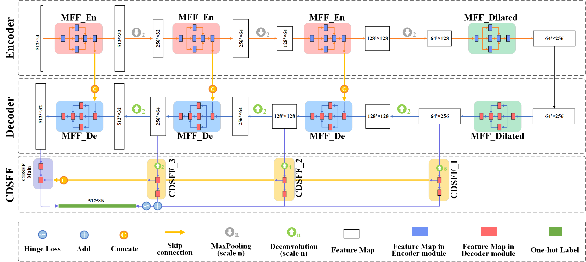

## [Controllably Deep Supervision and Multi-Scale Feature Fusion Network for Cloud and Snow Detection Based on Medium- and High-Resolution Imagery Dataset](<https://www.mdpi.com/2072-4292/13/23/4805>)


### Contents 

+ [CSD-Net](#CSD-Net)
+ [Requirements](#Requirements)
+ [Setup](#Setup)
+ [CSWV dataset](#CSWV)
+ [Dataset Access](#Dataset)
+ [Citation](#Citation)


### CSD-Net

+ &ensp; &ensp; In our work,  a convolutional neural network named ***CSD-Net*** 🚀🚀🚀was proposed for cloud and snow detection in medium- and high-resolution satellite images of distinct sensors. 

  

### Requirements
+ Python 3.7
+ Pytorch 1.8+ & CUDA&CUDNN with corresponding version

### Setup
+ Clone this repository.
```
git clone https://github.com/zhanggb1997/CSDNet-CSWV.git
```

### CSWV


+ &ensp; &ensp; Additionally , a novel high-resolution cloud and snow dataset (***CSWV***) was created and released. It contains two sub-datasets: the submeter-level high-resolution cloud and snow dataset (***CSWV_S6***) comprises six scenes with a resolution of 0.5 m; the meter- level high-resolution cloud and snow dataset (***CSWV_M21***) includes 21 resampled scenes with a resolution of 1–10 m. 


### Dataset Access

+  &ensp;  &ensp; The full CSWV dataset can be downloaded at [Baidu Disk](<https://pan.baidu.com/s/1PviazxiYg_sNNHREdBYneg>) (password: `cswv`)  or [Google Drive](<https://drive.google.com/drive/folders/1vvKT0zN0nAHD_ECzHMCO1YzS8v2_ZHBM?usp=sharing>). Any questions, contact Mr. Guangbin Zhang 💌<font color=blue>&lt;202072509@Yangtzeu.edu.cn&gt;</font>. This dataset is shared for academic purpose only. If you use the dataset, you should appropriately cite our paper ([PDF](<https://www.mdpi.com/2072-4292/13/23/4805/pdf>)): 

### Citation

```
@article{RN306,
   author = {Zhang, Guangbin and Gao, Xianjun and Yang, Yuanwei and Wang, Mingwei and Ran, Shuhao},
   title = {Controllably Deep Supervision and Multi-Scale Feature Fusion Network for Cloud and Snow Detection Based on Medium- and High-Resolution Imagery Dataset},
   journal = {Remote Sensing},
   volume = {13},
   number = {23},
   ISSN = {2072-4292},
   DOI = {10.3390/rs13234805},
   year = {2021},
   type = {Journal Article}
}
```